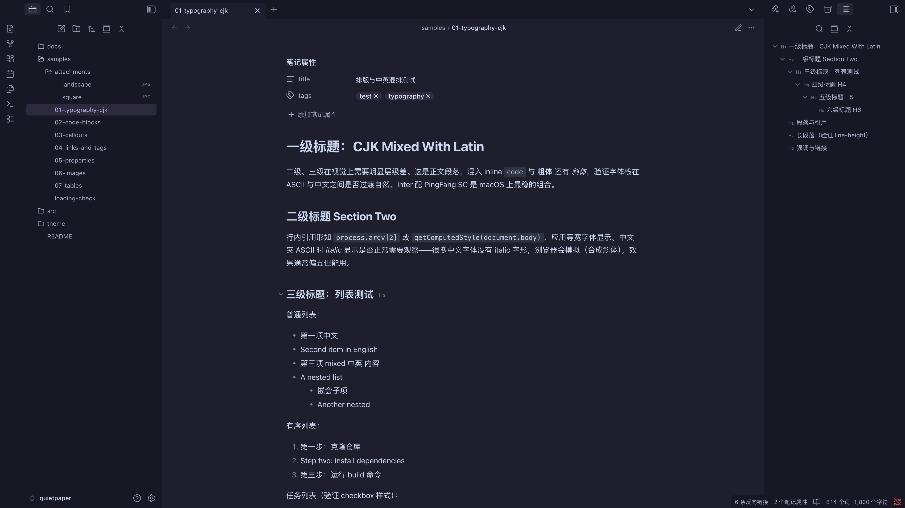

# Quietpaper

基于 Catppuccin 调色板的 Obsidian 主题。原生 CSS、`@layer` 分层、bun 单脚本构建。



## 设计原则

- **极简视觉**：默认不加 border，分隔依赖背景色阶或 inset shadow
- **CJK 排版**：中英混排间距、行高、内容宽度专门校准
- **单一强调色**：源自 Catppuccin 13 色强调色之一，覆盖 Obsidian 整套派生色
- **不集成 Style Settings**：配置变更走源码 + 重新构建，不暴露运行时开关
- **零运行时框架**：仅依赖 `@layer` / `oklch()` / `color-mix()` / CSS 变量

## 目录结构

```text
.
├── build.ts                     构建脚本（tokens / build / watch / sync / deploy）
├── src/
│   ├── theme.css                CSS 入口：@layer 声明 + @import
│   ├── tokens/
│   │   ├── generated.css        Catppuccin mocha + latte 色板（自动生成）
│   │   └── accent.css           主题强调色入口
│   ├── base/                    全局基础规则
│   ├── content/                 笔记内容元素
│   └── ui/                      Obsidian 界面与面板
├── theme/                       构建产物（Obsidian 实际加载这里）
│   ├── theme.css
│   └── manifest.json
└── samples/                     样本笔记（仓库即 dev vault，肉眼回归基准）
```

## 开发

```bash
bun install         # 安装依赖
bun run dev         # 监听 src/ 变更，自动重新构建
bun run build       # 生产构建（minified theme.css）
bun run deploy      # 构建并同步到 build.ts 中配置的目标 vault
```

仓库本身是 Obsidian dev vault：在 Obsidian 中选择 "Open folder as vault" 指向本目录即可即时预览。

## 修改主题

CSS 源码按职责分布在 `src/<base|content|ui>/`，文件名即组件名（`callouts.css` 改 callout、`navigation.css` 改文件树）。改完 `bun run dev` 监听重建，或一次性 `bun run deploy && obsidian command id=app:reload`。

更换强调色：编辑 `src/tokens/accent.css` 中 4 处 `mauve`，替换为 `rosewater / flamingo / pink / red / maroon / peach / yellow / green / teal / sky / sapphire / blue / lavender` 中任一。

## 使用主题

1. 在目标 vault 下创建目录 `.obsidian/themes/quietpaper/`
2. 将 `theme/theme.css` 与 `theme/manifest.json` 复制到该目录
3. 打开 Obsidian Settings → Appearance → Themes，选择 **quietpaper** 启用

## 样本笔记

`samples/` 覆盖各类排版与组件的触发语法，作为视觉回归基准：

- `01-typography-cjk.md` — 中英混排、标点、行内格式
- `02-code-blocks.md` — 行内 code 与多语言代码块
- `03-callouts.md` — 12 种 callout 类型
- `04-links-and-tags.md` — wikilink、外链、未解析链接、hashtag
- `05-properties.md` — frontmatter 字段类型
- `06-images.md` — 内嵌图、外链图、并排图
- `07-tables.md` — 对齐、行内格式、长内容

新增样式时同步补充对应触发语法，便于后续改动时直接对照验证。

## 依赖

- [bun](https://bun.com) ≥ 1.3
- [@catppuccin/palette](https://github.com/catppuccin/palette) — 配色数据源
- [lightningcss](https://lightningcss.dev) — CSS bundler
- [chokidar](https://github.com/paulmillr/chokidar) — 文件监听
- [Obsidian CLI](https://help.obsidian.md/cli) — 调试工具（随 Obsidian 桌面端附带）
